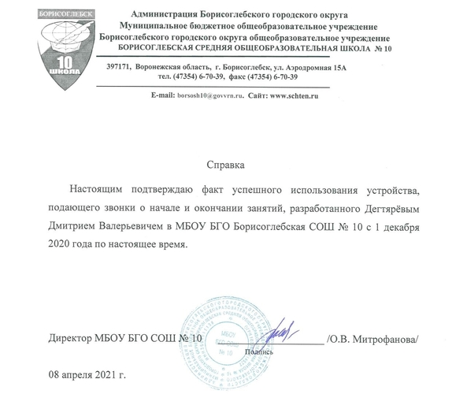

# WIFI-Zvonoc
WIFI-Zvonoc - это проек для автоматической покачи звонков в учебных заведениях или на заводах. Главное его отличе от аналогов, например как "Звонок М5", является наличие Web-интерфейса, спомощью которого легко настравивать.
## Цель
Разработать и создать IoT (Wi-Fi звонок)
## Здачи
1. Изучить актуальность данного направления.
2. Сравнить с существующими аналогами, если таковые имеются.
3. Сформулировать технические задачи, на основании которого произвести выбор доступной элементной базы под реализацию проекта.
4. Создать прототип изделия:  
  a. Написать программный код  
  b. Разработать электрическую принципиальную схему устройств  
  c. Разработать 3D модель корпуса изделия а также  его изготовление с помощью 3D принтера.
6. Произвести испытания данного устро
## 1.   Актуальность 
В век информационных технологий, когда каждая из отраслей претерпевает глобализации и информатизация, такой же средой является школа. Это касается не только учебного процесса, но также и инфраструктуры, одним из элементов которой является школьный звонок. В нашей работе мы предлагаем автоматизировать школьный звонок, сделать его удобным и современным, посредствам внедрения в него технологий IoT. Мы решили создать собственное устройство для подачи школьных звонков на базе платы еsp12E, со своим веб-интерфейсом и часами реального времени DS3131.
## 2. Аналоги которые мы нашли:
  
6000р
## 3. Техническое задание:
* Устройство должно работать как при наличии интернета, так и при отсутствии его.
* Устройство  должно взаимодействовать с пользователем через удобный веб-интерфейс.
* Устройство должно самостоятельно считать время при отсутствие интернета.  
## 4. Электрическая принципиальная схема
  
Платы заводского уровня изготовленые с помощью компании JLCPCB  

## Логика работы 
Если устройство включается первый раз или не может подключиться к зарегистрированной локальной Wi-Fi сети, то устройство выступает точкой доступа для последующих поправок в настройках, или автономной работе устройства без Wi-Fi сети.
## Web-интерфейс

## Процедрура аутентификация
Cхожа с аутентификацией у модемов

## 3D-модель корпуса

## Светодиодный матричный информер
Подробне в репозитории LED-Zvonoc
[ссылка на репозиторий](https://github.com/ddv11711/LED-Zvonoc)
## Планы на будущие
- [x] доработка информационной бегущей строки
- [ ] создание мини метеостанции
- [ ] выйти на рынок
## Технические характиристики

## Плюсы и минусы

## Вывод
Наше устройство автоматизирует систему подачи звонков, что упрощает жизнь не только школьному дежурному, но и каждому учащемуся. Теперь начало и конец урока определяются с точностью до долей секунд. Из системы подачи звонков пропадает человеческий фактор, и система становится более надежной, точной и гибкой в настройке. 
## Приложение

